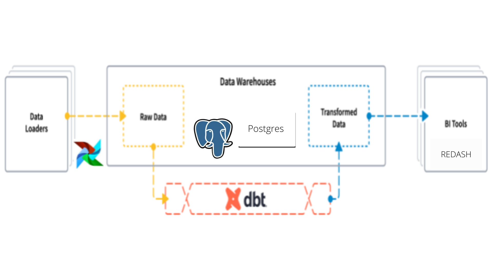

# Scalable-Data-Warehouse

<!-- Table of contents -->
- [Data Engineering: Data warehouse tech stack with MySQL, DBT, Airflow](#Scalable-Data-Warehouse)
  - [About](#about)
  - [Objectives](#objectives)
  - [Data](#data)
  - [Repository overview](#repository-overview)
  - [Contrbutors](#contrbutors)
  - [License](#license)

## About
<!-- import an image -->

A city traffic department wants to collect traffic data using swarm UAVs (drones) from a number of locations in the city and use the data collected for improving traffic flow in the city and for a number of other undisclosed projects. 

## Objectives
- Your startup is responsible for creating a scalable data warehouse that will host the vehicle trajectory data extracted by analysing footage taken by swarm drones and static roadside cameras. 
- The data warehouse should take into account future needs, organise data such that a number of downstream projects query the data efficiently.

## Data
- In [Downloads – pNEUMA | open-traffic (epfl.ch)](https://open-traffic.epfl.ch/index.php/downloads/#1599047632450-ebe509c8-1330) you can find a pNEUMA data: pNEUMA is an open large-scale dataset of naturalistic trajectories of half a million vehicles that have been collected by a one-of-a-kind experiment by a swarm of drones in the congested downtown area of Athens, Greece. Each file for a single (area, date, time) is ~87MB data.

## Repository overview
 Structure of the repository:
 
        ├── models  (contains trained model)
        ├── .github (github workflows for CI/CD, CML)
        ├── screenshots (Airflow DAG screenshots)
        ├── data (contains data versioning metedata)
        ├── scripts (contains the main script)	
        │   ├── logger.py (logger for the project)
        │   ├── preprocessing.py (dataset preprocessing)
        ├── notebooks	
        │   ├── trajectory_data_EDA.ipynb
        ├── tests 
        │   ├── test_preprocessing.py (test for the preprocessing script)
        ├── README.md (contains the project description)
        ├── requirements.txt (contains the required packages)
        |── LICENSE (license of the project)
        └── .dvc (contains the dvc configuration)

## Contrbutor(s)
- [Yohans Samuel](https://www.linkedin.com/in/yohanssamuel/)

## License
[MIT](https://choosealicense.com/licenses/mit/)

